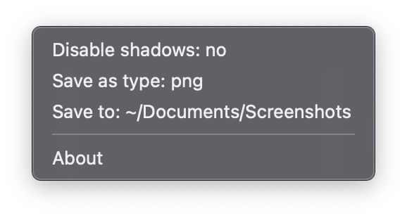

# xbar plugins

A collection of person plugins for [xbar][xbar], [SwiftBar][swiftbar], etc.

## Install xbar/SwiftBar

```sh
brew install xbar

# or

brew install swiftbar
```

## Screenshot Settings

Provides you with an easy way to change macOS' native screenshot settings.



### Install Screenshot Settings

1. Download the latest [plugin][screenshot-settings] version
1. Extract the archive
1. Place the `screenshot-settings.sh` file in your xbar/SwiftBar plugins
   directory

<!-- References -->

[screenshot-settings]: https://github.com/joaocarmo/xbar-plugins/releases
[swiftbar]: https://github.com/swiftbar/SwiftBar
[xbar]: https://github.com/matryer/xbar
